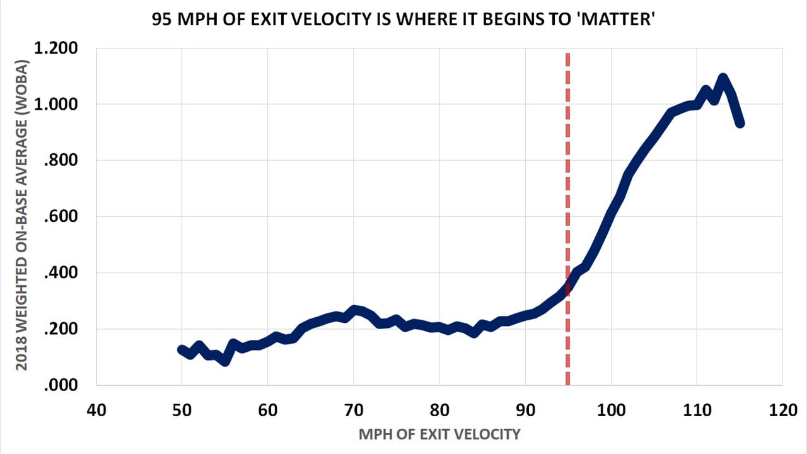

\maketitle
\newpage

```{r setup}
knitr::opts_chunk$set(echo = T)
library(dplyr)
library(readr)
library(purrr)

#Sets my working directory to where all my data lives and gets all the files from that folder


files <- list.files("C:/Users/Administrator/Documents/489 work/Project/Data", pattern = "\\.csv$", full.names = TRUE)

#merges all files together

df_original <- files %>%
  map_dfr(~ read_csv(.x, col_types = cols(.default = col_character())))

#for this code I used a mixture of looking up on stack overflow and then edited a couple things by myself and using chatGPT for certain syntax I was not familiar with
```

# Introduction

With the modern world moving towards using technology more in our daily lives, sports is no exception. Baseball is one of the forefront leaders in sports analytics. There has been extensive work done in Major League Baseball to incorporate data for teams and fans to use to elevate level of play and enjoyment. It can reshape the level of play and how the game is played at a fundamental level (Chen, et al. 2025). With the expansion of technologies like Trackman and Hawk-eye at the Major League level, it is natural for these same technologies to be incorporated at the college level. This is a level where many hopeful amateur players make their start and first get scouted by Major League teams. With a multitude viewers of Division 1 baseball, many reports are generated from this data to give Major League teams a more subjective look at each potential prospect. Division 3 baseball is not as nationally acclaimed, but it has lots of talent and now has access to data like Division 1s. Given that I play for a Division 3 baseball team, I have access to some of this data and am interested in some of the pitch analytics that can be offered at the Division 3 level. The research question is an exploratory one and is as follows: What pitch qualities at the division 3 level affect how hard a ball is hit?


# Data


This data is comprised of Trackman data from home Pomona-Pitzer baseball games from the 2024-2026 seasons. My variable of interest is exit speed and sometimes I categorize the data into hard hit, medium hit, and soft hit. The data points that are analyzed in this project are the ones with non-null values for the exit speed, as these are the only pitches with balls in play. The original dataset had 20,289 data points but after filtering, the dataset was left with 3,757 records. 

I will be looking at the pitch level data for this project. The other variables to predict exit speed I analyzed are: Pitch of the plate appearance (PitchOfPA), which arm the pitcher throws with (PitcherThrows), Batter hitting side (BatterSide), Outs, Balls, Strikes, Pitch Type (TaggedPitchType), PlayResult, pitch speed (RelSpeed), SpinRate, InducedVertBreak, HorizBreak, height of the pitch (PlateLocHeight), horizontal location of the pitch (PlateLocSide), Angle, and Distance. 

# Visualizations

```{r}
# adding the variables I want from the larger data set into a smaller one
df_original <- df_original %>%
  select(PitchofPA, PitcherThrows, BatterSide, Outs, Balls, Strikes, TaggedPitchType, PlayResult, RelSpeed, SpinRate, InducedVertBreak, HorzBreak, PlateLocHeight, PlateLocSide, ExitSpeed, Angle, Distance)
#filter for only balls with exit speed

df_baseball <- df_original %>%
  filter(!is.na(ExitSpeed))
# Change to numeric values
df_baseball <- df_baseball %>%
  mutate(across(
    c(PitchofPA, Outs, Balls, Strikes,
      RelSpeed, SpinRate, InducedVertBreak,
      HorzBreak, PlateLocHeight, PlateLocSide,
      ExitSpeed, Angle, Distance),
    as.numeric
  ))

avg_exit <- df_baseball %>%
  summarise(avg_exit_speed = mean(ExitSpeed, na.rm = TRUE))
#Plotting exit speed
library(ggplot2)
ggplot(df_baseball, aes(x = ExitSpeed)) +
  geom_histogram(bins = 30) +
  labs(title = "Exit Speed Distribution",
       x = "Exit Speed",
       y = "Count") +
  theme_minimal()
```
For this dataset, I defined a hard hit ball as anything over 90 miles per hour, a medium hit ball as anything between 90 mph and 70 mph, and a soft hit ball as anything below 70 mph. MLB defines as a hard hit ball as anything over 95 mph, but since Division 3 is a lower level and the athletes are not as physically developed, I lowered it. This is where MLB find that the production of these hit baseballs dramatically increases. This means that hits, home runs, and other outcomes are at a higher chance the higher the exit velocity goes, with 95 mph being a good split of hard hit and weakly hit (MLB.com, n. d.). When splitting up the data this way, I was able to get about 3 even bins to get a better distribution. 


As the chart shows, the weighted on-base percentage takes a dramatic turn upward once a ball is hit 95 miles per hour or harder. Weighted on-base percentage is a advanced metric used by MLB teams to measure how often a player gets on, and it is weighted based on number of bases from a hit. For example, a double is weighted more than a single as it gets two bases off of the initial hit rather than one from a single. 

```{r}

#Categorizing exit speeds as hard, medium, soft
df_baseball <- df_baseball %>%
  mutate(
    ExitSpeedCategory = case_when(
      ExitSpeed > 90 ~ "Hard Hit",
      ExitSpeed >= 70 & ExitSpeed <= 90 ~ "Medium Hit",
      ExitSpeed < 70 ~ "Soft Hit",
      TRUE ~ NA_character_
    )
  )
#Ordered the categories
df_baseball <- df_baseball %>%
  mutate(
    ExitSpeedCategory = factor(
      ExitSpeedCategory,
      levels = c("Soft Hit", "Medium Hit", "Hard Hit"),
      ordered = TRUE
    )
  )

#Plot
ggplot(df_baseball, aes(x = ExitSpeedCategory)) +
  geom_bar() +
  labs(title = "Distribution of Contact Quality",
       x = "Contact Category",
       y = "Count") +
  theme_minimal()
```

# Exploration

To explore what pitch qualities make a batter more likely to hit a ball hard, I analyzed distributions of variables I thought would impact the most. I looked at the pitch type, count of when the ball was hit, and pitch locations. 


```{r}

#Add column for calculated hard hit rate
hard_hit_rate <- df_baseball %>%
  group_by(TaggedPitchType) %>%
  summarise(
    TotalPitches = n(),
    HardHits = sum(ExitSpeedCategory == "Hard Hit", na.rm = TRUE),
    HardHitRate = HardHits / TotalPitches
  ) %>%
  arrange(desc(HardHitRate))
#Plot
ggplot(hard_hit_rate,
       aes(x = reorder(TaggedPitchType, HardHitRate),
           y = HardHitRate)) +
  geom_bar(stat = "identity") +
  coord_flip() +
  labs(title = "Hard Hit Rate by Pitch Type",
       x = "Pitch Type",
       y = "Hard Hit Rate") +
  theme_minimal()
```
```{r}
print(hard_hit_rate)
```


This graph is constructed using the hard hit rates of each pitch type. It takes the total number of hard hit balls for each pitch type and divides by the total number of that pitch in the dataset. Looking at the graph, some pitches stick out as being easier to hit, like Sweepers, Sinkers, and TwoSeamFastballs. There are also pitches seen as harder to hit, like FourSeamFastballs, Splitters, and Curveballs. However, with Sweepers and FourSeamFastballs, when looking at the total amount of data points, these pitch types have limited data and this can skew the data as there is not enough data to stabilize the results and give true values. The limitations and impacts of this will be discussed in the later sections. 

```{r}
#Combine Balls and strikes category into one count category for ease of visualisation
df_baseball <- df_baseball %>%
  mutate(Count = paste(Balls, Strikes, sep = "-"))
hard_hit_count <- df_baseball %>%
  group_by(Count) %>%
  summarise(
    TotalPitches = n(),
    HardHits = sum(ExitSpeedCategory == "Hard Hit", na.rm = TRUE),
    HardHitRate = HardHits / TotalPitches
  ) %>%
  arrange(desc(HardHitRate))

print(hard_hit_count)
ggplot(hard_hit_count,
       aes(x = reorder(Count, HardHitRate),
           y = HardHitRate)) +
  geom_bar(stat = "identity") +
  labs(title = "Hard Hit Rate by Count",
       x = "Count",
       y = "Hard Hit Rate") +
  theme_minimal()
```
From the graph, we can see that Two strike counts are the ones with the lowest associated hard hit rates. the count 3-0 has an even lower hard hit rate but again has a limited amount of total pitches, meaning the data may be skewed and not accurately reflect how it would behave over a large amount of data points. Counts with less than two stikes saw higher rates of hard hit balls. 


```{r}

#Create a plot with a rectangle for the strike zone
ggplot(df_baseball,
       aes(x = PlateLocSide,
           y = PlateLocHeight,
           color = ExitSpeedCategory)) +

  geom_point(alpha = 0.5) +

  geom_rect(aes(xmin = -0.7,
                xmax = 0.7,
                ymin = 1.7,
                ymax = 3.5),
            fill = NA,
            color = "black",
            linewidth = 1) +

  labs(title = "Pitch Location vs Contact Quality",
       x = "Horizontal Location",
       y = "Vertical Location") +

  theme_minimal()+coord_fixed()
# Just look at the hard hit balls
ggplot(filter(df_baseball,
              ExitSpeedCategory == "Hard Hit"),
       aes(x = PlateLocSide,
           y = PlateLocHeight)) +

  geom_point(alpha = 0.5, color = "red") +

  geom_rect(aes(xmin = -0.83,
                xmax = 0.83,
                ymin = 1.5,
                ymax = 3.5),
            fill = NA,
            color = "black",
            linewidth = 1) +

  labs(title = "Locations of Hard Hit Balls",
       x = "Horizontal Location",
       y = "Vertical Location") +

  theme_minimal()+coord_fixed()
# Density Plot
ggplot(filter(df_baseball,
              ExitSpeedCategory == "Hard Hit"),
       aes(x = PlateLocSide,
           y = PlateLocHeight)) +

  stat_density_2d(aes(fill = after_stat(level)),
                  geom = "polygon",
                  alpha = 0.6) +

  geom_rect(aes(xmin = -0.83,
                xmax = 0.83,
                ymin = 1.5,
                ymax = 3.5),
            fill = NA,
            color = "black",
            linewidth = 1) +

  labs(title = "Density of Hard Hit Ball Locations",
       x = "Horizontal Location",
       y = "Vertical Location") +

  theme_minimal() +
  coord_fixed()
```
These three graphs are looking at the locations of where the ball ended up in the zone for the batter to hit and the resulting classification of exit speed for each pitch. The first looks at all pitches in the dataset. The second graph is much more appropriate for the research question as it shows the location of just hard hit balls and it makes it easier to see and determine patterns. The final graph is a density plot and provides an even easier graph to look at and interpret. In each plot, a rectangle was created to mimic the strike zone. The plate is 17 inches wide, so the width of the strike zone is 8.5 inches from the center point of 0 and the height of the strike zone was estimated from 1.75 feet to 3.5 feet, which approximately aligns with the knees and mid-torso region of the body that is generally accepted as the strike zone in lower level baseball. 

Looking at the graphs, it can be noted that the density of hard hit balls is in the middle of the strike zone, with each distance away having less hard hit balls. This makes sense as hitters are looking for pitches down the middle and these are generally the easiest to see and hit. Pitches outside of the strike zone are difficult to hit hard as they can cause a hitter to take bad swings. 


# Modeling

After noting some of the trends from the key features explored, I created a linear model to mathematically observe the impact of the independent variables on the dependent variable of exit speed. The model was created using all of the key features outlined in the data section. 
```{r}
full_model <- lm(
  ExitSpeed ~ PlateLocSide +
             PlateLocHeight +
             RelSpeed +
             SpinRate +
             InducedVertBreak +
             HorzBreak +
             Balls +
             Strikes +
             TaggedPitchType,
  data = df_baseball
)

summary(full_model)
```
From this linear model, I used the exit velocity as a numeric variable instead of a categorical to view the impact at a unit level each of the variables has on the exit velocity. My model found that it had 6 statistically significant variables that affected the exit velocity: PlateLocHeight, InducedVertBreak, Balls, TaggedPitchTypeCurveball, TaggedPitchTypeFastball, TaggedPitchTypeSinker. Out of these variables, the InducedVertBreak variable had a low practical significance, making it a variable of non-interest when discussing the results. To determine the impact of each of these variables, the data could be interpreted like the following example for numeric variable PlateLocHeight: For each additional foot of location vertically, it is associated with a 2.47 mph decrease in exit speed on average. The Categorical variables would be interpreted like the following example for TaggedPitchTypeCurveball: When a pitch is tagged type curveball, it is associated with a 4.3 mph decrease in exit velocity in comparison to the changeup. This is because changeup is our dummy variable when all other values are 0 for the tagged pitch type.  The R-squared value of my regression was .0227, meaning that these variables only explained 2.27% of the variation in the exit velocity, meaning that this is not a good model for explaining exit velocity. 


# Results and Discussion

When the results of the linear model were output, I was surprised by the low R-Squared value. With the previous results from the graphs created, I thought that there would be a higher R-Squared value. There were clear trends that appeared in my graphs for Count, pitch location, and pitch type. Even in the variables that were found to be statistically significant, these variables often had low amounts of statistical significance. This could stem from many things. Hitting a baseball is a complex movement that relies on context as well as many pitching variables. Sports are a physical battle often between two or more people. Baseball is no different. With pitching and hitting there are a lot of variables that cannot or are difficult to be captured by a pitch tracking machine like Trackman. Things like how deceptive the ball comes out of a pitcher's hand, how good of a hitter each person is, what the situation is, what the previous pitcher looked like in comparison to the current one, how good or strong a hitter is, and weather are all things that could impact how hard a ball is hit that would not be captured in this pitching data. There is a lot of data inside of this dataset that has to deal with pitch data but is complicated or nuanced, making it hard to use and adjust for a project. The results of this project were interesting but cannot be used to determine hit speed alone. However, this data and methodology could be used for other aspects relating to sports. Noticing certain trends in the pitch data can be used for game planning and looking for areas of improvement. For example, if hitters are hitting the ball harder in counts where there are more balls than strikes, a coach can use this data and relay it to the pitchers to work on getting more strikes early in the count. The types of graphs and models used could also be helpful for teams when creating scouting reports for hitters. For example, the density map of hard hit balls can be narrowed in on specific hitters and be used to let pitchers know to avoid certain zones to certain hitters. 

# Limitations and Future Changes

There were some glaring limitations with the data from the project. First, the data is only extracted from one team in Division 3 baseball with about 150 games ranging over 3 years. This can create an issue with repeat pitchers and hitters. This would skew the data unknowingly and give biased results. With MLB teams, they are able to get years of every single game of every single team which gives MLB teams thousands of games and hundred of thousands of pitches. This larger amount of data spread out over the entire league would give more normalized, unbiased results that would be useful to apply anywhere, rather than just one specific team. In a potential future work more data points with different teams would be ideal, however getting this data could provide difficult as most teams only make their data public to their own teams. 

Another limitation is the TaggedPitchType variable. This variable is entered manually by an operator and this could introduce bias into the data. The operator could make mistakes in tagging the pitch type or have different interpretations of what each pitch is. This is apparent when looking at pitches like sweeper and four seam fastball. These pitches are similar or the same as slider and fastball, but the operator one day decided to add these pitch types that were not used afterwards. This introduced a small amount of these pitches that appears in the data that are skewed and could distort interpretations. Introducing more standard pitch naming and better training could improve this for data collection. 

# References

Chen, Z., Robbins, T., Gephardt, W., Nestler, S., & CAP-X. (2025). Reshaping baseball: The impact of analytics and technology | orms today. https://pubsonline.informs.org/do/10.1287/orms.2025.02.07/full/ 

Hard-hit rate: Glossary. MLB.com. (n.d.). https://www.mlb.com/glossary/statcast/hard-hit-rate 